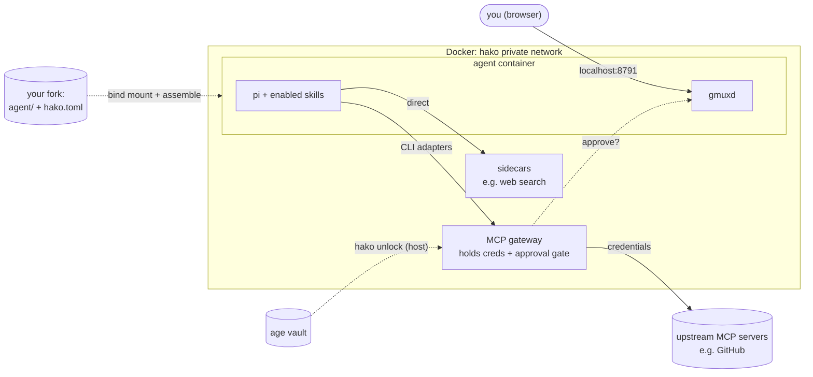

# hako

**An opinionated, sandboxed home for a coding agent.** Clone it, bring your own
agent credentials, and you get **pi** running in a container with live browser
access — without handing the agent your host or your keys. Customize by forking.

## Quickstart

```sh
git clone https://github.com/mgabor3141/hako && cd hako
docker compose up -d                  # build + start; gmux on :8791
# first start installs the dev toolchain into the home (~15s, in the background)
docker compose exec hako gmuxd auth   # prints a login URL + token
# open http://localhost:8791, authenticate, then:
docker compose exec hako gmux pi      # launch the agent (authenticate it once)
```

Your pi sessions show up live at <http://localhost:8791>. There's also a host
launcher — `./hako up`, `./hako shell`, `./hako pi`, … (run `./hako` for the
list). `./hako` is a bootstrap that builds a small Go binary on first run (needs
Go for now; prebuilt releases are coming), then assembles your enabled
integrations and drives the stack.

**Windows / WSL2:** run from inside your WSL2 distro (Docker Desktop WSL
integration on) and **clone into the Linux home (`~`), not `/mnt/c/...`** — bind
mounts and permissions only behave on the native filesystem.

## Architecture



- **Your fork is the unit of customization.** `./agent/` is **bind-mounted as
  the agent's entire home**, so config, projects, and scratch all live in the
  repo. Nothing on your host (including `~/.pi`) is touched.
- **The agent holds no host credentials** — the security boundary is the
  *absence* of secrets, not behavior restrictions. When it needs a real tool it
  goes through the **MCP gateway**, which holds the creds and gates sensitive
  calls behind your approval (a `y/N` session in the gmux dashboard). Which tools
  exist is set by the **integrations** you enable (below).

## Tools

hako leans on a few well-chosen tools so it stays small and legible:

- **Docker (Compose)** — the only thing you install on the host. Runs the
  sandbox and the private network between the agent and the gateway.
- **pi** — the coding agent you actually use; preconfigured with hako's opinions
  in `agent/.pi/agent/`. Bring your own provider; hako ships no credentials.
- **gmux** — browser access to terminal sessions: watch and attach to the agent
  live at `:8791` (loopback-only, token-authed).
- **mise** — pins and installs the in-home dev toolchain (node, bun, python,
  ripgrep, fd, jj, …) from a lockfile. It also enforces a **supply-chain release
  delay**: a new release isn't adopted until it has been public for ≥24h, so a
  freshly-compromised version can be caught or yanked before hako installs it.
- **bun** — runs pi and the MCP CLI adapters (one fast binary, no node_modules
  churn). `pi update` is rerouted through mise so the pinned core stays pinned.
- **MCP gateway** — a fork of [`mcp-proxy`](https://github.com/TBXark/mcp-proxy)
  that holds upstream credentials and exposes tools to the agent over the private
  network, gating chosen calls behind a swappable approval hook (default: a `y/N`
  session in the gmux dashboard). The agent's CLI **adapters** come from the
  `integrations/` catalog and never see the keys.
- **hako (the launcher)** — `./hako` bootstraps a small Go binary that assembles
  your enabled integrations, wraps `docker compose`, and unseals the vault. Plain
  `docker compose` still works for the basics.

## Integrations

What the agent can reach is **composable**. Each tool lives in `integrations/` —
a skill the agent calls, an optional gateway backend, an optional sidecar
container, plus any secrets/settings it needs. You turn them on in **`hako.toml`**
(gitignored, so picking tools is never a fork or a merge conflict); disabled ones
are invisible to the agent — no skill in its context, no gateway route, no
sidecar.

```sh
./hako configure       # a TUI to toggle integrations, set options, seal secrets
./hako up              # assembles only the enabled integrations
```

Shipped today: **github** (PRs/issues/CI through the gateway) and **websearch**
(a bundled search sidecar, or your own endpoint). Add more by dropping a folder
in `integrations/` — see [`integrations/README.md`](./integrations/README.md).

## Secrets

The agent holds none. Credentials live in a single **age-encrypted vault**
(`vault/secrets.age`) under **one passphrase**, and only the gateway gets them —
decrypted on your host at unlock time and handed straight to the gateway, never
written to disk.

```sh
./hako seal github     # paste a token; set the vault passphrase
./hako up              # prompts for the passphrase and unseals
./hako unlock          # re-enter it after a gateway restart (which re-seals)
```

## Handy in the shell

The human shell (zsh) ships some niceties — run `help` inside the container for
the full, colorized list:

- `Ctrl-R` fuzzy history, `Ctrl-T` file picker, `Alt-C` fuzzy `cd` (fzf)
- `→` / `End` accepts the grey autosuggestion from your history
- `z <name>` jumps to a frequent dir (zoxide); a bare dir name `cd`s into it
- `ls`/`ll`/`la`/`lt`/`l.` are [eza](https://eza.rocks); `bat` and `man` are syntax-highlighted

pi itself always runs plain `/bin/bash` with stock `ls`/`grep`, so commands it
hands you paste-and-run unchanged.

## Customizing

hako is meant to be **forked and `git pull`ed** — opinions, including the pinned
`mise.lock`, surface as merge conflicts you resolve.

- **pi config:** `agent/.pi/agent/settings.json` — live (restart to reconcile).
- **toolchain:** add tools to `agent/.config/mise/config.toml`, then
  `mise install` (or restart) — live.
- **OS image:** `container/Dockerfile` — needs `docker compose up -d --build`.

The configuring agent's guide is [`AGENTS.md`](./AGENTS.md); design decisions
live in [`docs/`](./docs/).

## Backups (optional)

Off by default. To snapshot the agent home to a repo the agent can't reach,
follow [`docs/backups.md`](./docs/backups.md) (a restic sidecar) — or just hand
that file to your agent.

## Roadmap

- **Phase 1 — pi + container + gmux** *(done)*: clone-and-up opinionated pi.
- **Phase 2 — governed tools** *(done)*: the MCP gateway, per-call approval (in
  gmux), composable integrations, and the age vault — the agent reaches real
  tools holding no credentials.
- **Next:** cut the first tagged launcher release, so hosts without Go fetch a
  pinned, checksummed binary (the pipeline and the verifying bootstrap are in
  place).
